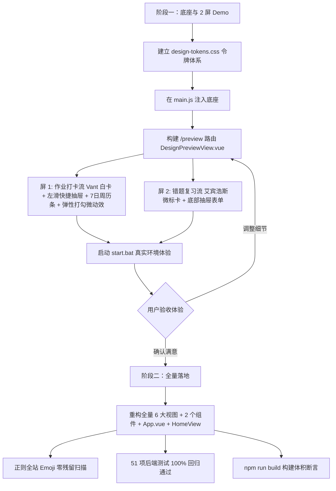

# 全局 UI/UX 统一设计系统与交互重构计划 (UI/UX Polish Pass)

> **文档状态**：已通过 `/grill-me` 深度访谈，完成 **视觉规范（UI）** 与 **大厂级交互体验（UX）** 的双重对齐。  
> **双文档同步**：本计划与 [implementation_plan.md](file:///c:/Users/ww/.gemini/antigravity-ide/brain/7faf209e-d75f-41e6-b70e-be8911cac3e4/implementation_plan.md) 保持 100% 逐字同步。  
> **核心交付原则**：**分阶段实施 —— 先输出真实 Vue 3 核心 2 屏 Demo（`/preview`）供实机交互体验验收，经用户确认满意后再全量铺开全部业务页面**。

---

## 一、 背景与重构目标

系统已全面完成 M1~M5 的后端业务与数据闭环，但前端各页面由不同阶段逐步演进，在视觉（UI）与交互（UX）上存在明显的草稿感与割裂感：
1. **滥用 OS 原生 Emoji**：全站散落了大量系统字符级 emoji（📅, 📝, 🔒, 🎓, ⚠️, 📈, 🕸️, 📋, ⚡, 📚, ⚙️, 🚀, 🖨️, 🤖, 🍎, 🟢, 🍅, 💡, 🌟, 🧠, ✂️, 🔍, ✍️, 📷 等），在不同平台粗细色彩迥异，严重削弱专业感；
2. **缺乏统一的设计令牌体系（Design Tokens）**：各页面卡片圆角、阴影、背景浅灰色阶、外边距各不相同；
3. **交互流缺乏大厂移动端规范（UX 缺陷）**：
   - 列表卡片按钮堆砌，视觉杂乱且易误触；
   - 日期翻页全靠点按微小箭头，缺乏大拇指热区与手势支持；
   - 弹窗采用桌面端时代的“屏幕居中 Modal”，遮挡视线且被移动端软键盘顶起错位；
   - 打卡缺乏即时正向反馈，孩子完成全天作业后缺乏成就感仪式。

**重构目标**：
遵循 `baoyu-design` 规范与苹果 iOS / 微信 / 滴答清单等成熟移动端设计范式，建立全站统摄的 **Design Tokens**（`src/assets/design-tokens.css`），**100% 彻底清除全站字符 Emoji**，统一微徽章（`st-icon-badge`）系统与纯净浅色系；同时引入 **左滑快捷抽屉（`van-swipe-cell`）**、**顶部 7 日横向日历条 + 滑动手势**、**打卡微动效与 100% 达成成就微反馈**、**底部半屏抽屉化（Bottom Sheet）** 等大厂级 UX 体验，打造极简、优雅、高质感的新一代中学生学习工具。

---

## 二、 视觉设计规范体系 (Design Tokens & Language)

### 1. 7 种语义色令牌与 Icon Badge 微徽章体系
全面禁止在文本中直接嵌入系统 Emoji。引入统一的 **`st-icon-badge`** 容器：`26×26px` 微圆角（`border-radius: 8px`）浅色透明底衬，内部嵌入标准矢量 `<van-icon>`：

| 语义色 Token | 背景色变量 | 图标色变量 | 适用场景与业务含义 |
|:--|:--|:--|:--|
| **Primary 蓝** | `--st-primary-light: #eff6ff` | `--st-primary: #2563eb` | 常规模块、分析看板、成绩走势、历史组卷 |
| **Success 绿** | `--st-success-light: #ecfdf5` | `--st-success: #10b981` | 作业打卡完成、知识点掌握、微信 PushPlus 渠道 |
| **Warning 橙** | `--st-warning-light: #fffbeb` | `--st-warning: #f59e0b` | 待复习提醒、Server酱渠道、科目未完成频次分布 |
| **Danger 红** | `--st-danger-light: #fef2f2` | `--st-danger: #ef4444` | 薄弱诊断预警、遗忘顽固题、专注计时器、安全警示 |
| **Info 天蓝** | `--st-info-light: #f0f9ff` | `--st-info: #0284c7` | 7 科雷达均衡度、规则提示、说明小贴士、月度深度透视 |
| **Purple 紫** | `--st-purple-light: #f5f3ff` | `--st-purple: #7c3aed` | 艾宾浩斯复习算法、iOS Bark 渠道 |
| **Neutral 灰** | `--st-neutral-light: #f1f5f9` | `--st-neutral: #475569` | 历史台账、群机器人 Webhook 渠道、辅助元数据 |

### 2. 统一颜色与表面层次（Semantic Tokens）
- **页面背景**：`--st-bg-page: #f8fafc`（Slate-50，柔和护眼）
- **卡片表面**：`--st-bg-card: #ffffff`（纯白表面）
- **卡片边框**：`--st-border: #f1f5f9`（默认细边框）；激活/悬浮：`--st-border-bold: #e2e8f0`
- **卡片阴影**：`--st-shadow-card: 0 1px 3px rgba(15, 23, 42, 0.04), 0 1px 2px rgba(15, 23, 42, 0.02)`
- **文字层级**：
  - 标题 Primary: `#0f172a`（Slate-900，`font-weight: 600`）
  - 正文 Regular: `#334155`（Slate-700）
  - 次级 Secondary: `#64748b`（Slate-500）
  - 弱提示 Muted: `#94a3b8`（Slate-400）

### 3. 组件级统一标准
- **卡片容器**：全站统一使用 `.st-card`，圆角 `border-radius: 14px`，内边距 `14px 16px`，移除一切生硬黑蓝渐变。
- **Section 标题行**：统一为 `.st-section-header`（左侧 Icon Badge + 15px 加粗标题，右侧弱化辅助操作）。
- **学科微标签（Subject Tags）**：使用专门的 `.st-subject-tag`（`height: 22px; padding: 2px 8px; white-space: nowrap; font-size: 11px;`），彻底杜绝将纯文字放入 `26×26px` 单图标徽章导致的文字纵向折行竖排，并按学科分配专属语义色（数学-蓝、英语-紫、语文-绿、物化-青、生化-黄、政史-红）。
- **筛选药丸标签（Chips）**：统一为 `.st-chip`，激活态：品牌蓝背景高亮；未激活态：`border: 1px solid #e2e8f0; background: #ffffff; color: #475569;`。
- **底部抽屉 PC 居中适配**：统一配置 `.bottom-sheet-modal` 桌面端居中规则（`left: 0 !important; right: 0 !important; margin: 0 auto !important; max-width: 500px !important;`），杜绝在宽屏电脑下弹窗脱离容器吸附在屏幕最左下角。
- **空状态**：全站一律使用 `<van-empty>` 搭配清新轻量文案，彻底移除包含 emoji 的生硬提示。
- **弹窗标题**：系统 `showDialog` / `showToast` 标题全面纯净文字化，移除所有状态 Emoji。

---

## 三、 借鉴大厂交互体验设计规范 (UX Interaction Flow)

基于 `/grill-me` 访谈确认的 5 大交互核心决策，全面重塑前端交互体验：

### 1. 列表操作体验：左滑快捷抽屉（`van-swipe-cell`）
- **卡片正面极致克制**：作业卡片正面仅保留「大号圆形 Checkbox」、「学科微标签」与「作业标题/截止要求」，彻底拿掉平铺在卡片表面的“转错题”、“删除”按钮；
- **单手轻击打卡**：轻触勾选框或卡片主区域即刻切换打卡状态；
- **向左轻滑呼出操作**：向左轻滑卡片顺滑展开右侧隐藏功能抽屉：
  - **转错题按钮**（蓝色背景，`<van-icon name="plus" />`）；
  - **删除按钮**（红色背景，`<van-icon name="delete-o" />`）；
- **效果**：列表呼吸感大增，消除视觉噪点，同时彻底杜绝误触删除。

### 2. 日期导航体验：顶部 7 日横向胶囊条 + 手势严格解耦
- **顶部 7 日横向日历条（Week Strip）**：
  - 在作业顶栏嵌入紧凑的 7 日横向药丸胶囊（Mon ~ Sun）；
  - 每个胶囊直观展示星期、日期，并在下方带有已完成打卡的绿色微圆点；
  - 选中当前日期时高亮为品牌蓝药丸，大拇指单手轻触即可在周内无缝穿梭；
- **左右轻滑翻日手势与列表手势严格解耦（Gesture Isolation）**：
  - 将横向滑动手势（Swipe Navigation）严格限定在顶部横向胶囊周历条（Week Strip）；
  - 作业主列表区域彻底移除容器级横向滑动手势监听，将其 100% 专供卡片自身的 `van-swipe-cell` 左滑快捷抽屉（转错题、删除），彻底杜绝在删除作业或侧滑卡片时误触翻日的冲突 Bug。

### 3. 正向激励与微动效体验 (Positive Reinforcement)
- **单项勾选弹性微动效**：
  - 勾选作业打卡时，圆形 Checkmark 触发 150ms 的轻微缩放弹性动效（Scale 0.9 $\to$ 1.1 $\to$ 1.0），伴随对勾画线呈现；
  - 已完成条目文本平滑变浅灰，带有柔和过渡；
- **全天 100% 达成成就微反馈**：
  - 当全天作业进度达到 100% 时，顶部进度条从蓝色平滑变为鲜活的 Success 绿色；
  - 在顶栏触发优雅的「今日作业全部完成」微徽章轻弹动反馈（非打断式弹窗），给学生恰到好处的心理满足感与仪式感。

### 4. 表单与弹窗体验：移动端底部半屏抽屉范式 (Bottom Sheet)
- **全面摒弃居中弹窗**：居中 Modal 会阻断视觉连贯性且常被虚拟键盘遮挡；
- **全面采用 `van-popup position="bottom" round`**：
  - **新增作业面板**：从屏幕底部平滑升起，顶部带有微灰指示条（Grabber），直接处于大拇指自然点击区，完美避让软键盘；
  - **PIN 门禁验证面板**：底部弹出数字锁键盘与输入区；
  - **错题快捷录入面板**：由底部半屏升起，流畅进行文字录入与 OCR 拍照切换。

### 5. 加载与空状态体验：轻量简洁原则
- 遵循极简实用主义：数据加载使用居中轻量菊花 Loading；
- 无数据时展示轻量清新 `<van-empty>`，不引入多余复杂的占位骨架屏与强制下拉刷新手势，保持系统纯粹轻快。

---

## 四、 逐文件逐行 Emoji 清除与改造全量清单 (100% 展开无省略)

### 1. [frontend/src/App.vue](file:///d:/工作/ww/personal_work/study_trace/frontend/src/App.vue)（全局底座）
- **布局规范**：
  - `.app-container`：统一最大宽度 `500px` 水平居中，背景色 `--st-bg-page: #f8fafc`，阴影收敛为柔和扩散阴影；
  - 针对平板与桌面端提供平滑自适应容器居中体验；
- **底部导航栏**：
  - 底部 `<van-tabbar>` 配置磨砂白底衬（`background: rgba(255, 255, 255, 0.95); backdrop-filter: blur(10px)`）与柔和顶部分割线；
  - 激活色对齐品牌蓝 `--st-primary`（`#2563eb`），未激活色对齐次级字 `--st-muted`（`#94a3b8`）。

---

### 2. [frontend/src/views/HomeworkView.vue](file:///d:/工作/ww/personal_work/study_trace/frontend/src/views/HomeworkView.vue)（作业打卡与手势）
- **L006/011 导航箭头**：`<button class="nav-btn">❮</button>` / `❯` $\to$ 升级为顶部 7 日横向药丸条 + 列表左右滑动手势；
- **L009 日期日历**：`📅` $\to$ `<van-icon name="calendar-o" class="cal-icon" />`
- **L015 连续打卡**：`🔥 连续 <b>{{ streak }}</b> 天` $\to$ `<van-icon name="fire" color="#f97316" /> 连续 <b>{{ streak }}</b> 天`
- **L018 家长门禁**：`🔒` $\to$ `
<van-icon name="setting-o" />
`
- **L069 打勾状态**：`✓` $\to$ SVG 弹性微缩放勾选动效；
- **L084 转错题按钮**：从卡片表面剥离，收纳至 `<van-swipe-cell>` 左滑抽屉中；
- **L496 底部悬浮遮罩**：移除渐变黑灰混杂，采用规范的磨砂半透明白底 `.floating-footer`；
- **新增表单**：居中 Modal 全面改造为底部半屏抽屉 `<van-popup position="bottom" round>`。

---

### 3. [frontend/src/views/MistakeView.vue](file:///d:/工作/ww/personal_work/study_trace/frontend/src/views/MistakeView.vue)（错题本与艾宾浩斯复习）
- **L095 忘记按钮**：`✕ 又忘了` $\to$ `<van-button size="small" plain type="danger" icon="cross" @click="handleReview(item, false)">又忘了</van-button>`
- **L098 掌握按钮**：`✓ 掌握啦` $\to$ `<van-button size="small" type="success" icon="passed" @click="handleReview(item, true)">掌握啦</van-button>`
- **L112 悬浮录入按钮**：`＋ 录入错题` $\to$ `<van-button round type="primary" icon="plus" class="fab-add" @click="openAddModal">录入错题</van-button>`
- **L176 OCR 识别**：`🔍 一键提取题干` $\to$ `<van-button size="small" type="primary" plain icon="scan" @click="triggerOcr">智能提取题干</van-button>`
- **卡片层次**：错题卡片全面应用 `.st-card`，复习倒计时徽章使用 `.st-icon-badge--purple`（艾宾浩斯规范）。

---

### 4. [frontend/src/views/ScoreView.vue](file:///d:/工作/ww/personal_work/study_trace/frontend/src/views/ScoreView.vue)（学情成绩与走势）
- **L027 学员档案**：`🎓` $\to$ `<van-icon name="award-o" />`
- **L060 薄弱诊断**：`⚠️ 薄弱学科诊断建议...` $\to$ `
<van-icon name="warning" /> 薄弱学科诊断建议 ({{ weakSubjects.length }} 门)
`
- **L082 优良提示**：`🎉` $\to$ `<van-icon name="passed" color="#10b981" />`
- **L090 走势折线**：`📈` $\to$ `<van-icon name="chart-trending-o" />`
- **L119 单次走势提示**：`💡 当前仅有 1 次考试数据...` $\to$ `<van-notice-bar left-icon="info-o" :scrollable="false" text="当前仅有 1 次考试数据，已作为独立参考点呈现，后续录入将自动生成连贯走势。" />`
- **L130 雷达图**：`🕸️` $\to$ `<van-icon name="aim" />`
- **L147 缺考警告**：`⚠️` $\to$ `<van-icon name="warning" color="#ef4444" />`
- **L153 不足 3 科提示**：`📐` $\to$ `<van-icon name="info-o" color="#94a3b8" />`
- **L163 历史台账**：`📋` $\to$ `<van-icon name="records-o" />`
- **L206 考试日期**：`📅 {{ exam.exam_date }}` $\to$ `<van-icon name="calendar-o" /> {{ exam.exam_date }}`
- **L984 消除深黑渐变**：移除硬编码 `linear-gradient(135deg, #1e293b 0%, #0f172a 100%)`，重构为纯净白底 `.st-card`，文字主次色阶与投影完全与系统统一；
- **PIN 弹窗升级**：解锁 PIN 弹窗改为底部抽屉呼出。

---

### 5. [frontend/src/views/PaperCenterView.vue](file:///d:/工作/ww/personal_work/study_trace/frontend/src/views/PaperCenterView.vue)（组卷中心）
- **L018 预设标题**：`⚡ 一键快捷组卷预设` $\to$ `
<van-icon name="fire-o" /> 一键快捷组卷预设
`
- **L037 学科筛选**：`📚 学科筛选` $\to$ `
<van-icon name="filter-o" /> 学科筛选
`
- **L113 排版配置**：`⚙️ 试卷排版规范配置` $\to$ `
<van-icon name="setting-o" /> 试卷排版规范配置
`
- **L182 组卷按钮**：`📄 一键生成 A4 重练卷` $\to$ `<van-button icon="description" type="primary" block ...>一键生成 A4 重练卷</van-button>`
- **L200 历史组卷记录**：`<h3>📋 历史组卷记录</h3>` $\to$ `
<van-icon name="records-o" /> <h3>历史组卷记录</h3>
`
- **L257 预设选项本周**：`icon: '🌟'` $\to$ `icon: 'star-o'`, `badgeColor: 'warning'`
- **L258 预设选项艾宾浩斯**：`icon: '🧠'` $\to$ `icon: 'replay'`, `badgeColor: 'purple'`
- **L259 预设选项高频**：`icon: '⚠️'` $\to$ `icon: 'warning-o'`, `badgeColor: 'danger'`
- **L260 预设选项全库**：`icon: '📚'` $\to$ `icon: 'notes-o'`, `badgeColor: 'primary'`
- **L716 提交按钮渐变**：移除硬编码 `linear-gradient(135deg, #2563eb, #1d4ed8)`，统一使用品牌色 `--van-primary-color`。

---

### 6. [frontend/src/views/PaperPrintView.vue](file:///d:/工作/ww/personal_work/study_trace/frontend/src/views/PaperPrintView.vue)（A4 试卷与预览）
- **L014 重练打卡按钮**：`📝 重练打卡` $\to$ `<van-button size="small" type="primary" icon="passed" @click="openReviewModal">重练打卡</van-button>`
- **L015 打印按钮**：`🖨️ 打印 / 存PDF` $\to$ `<van-button size="small" type="success" icon="printer" @click="handlePrint">打印 / 存PDF</van-button>`
- **L028 换页说明文案**：`「✂️ 在此题前换页」` $\to$ `「在此题前换页」`
- **L101 已换页提示**：`✂️ 已在此处换页（点击取消）` $\to$ `<van-icon name="cut" /> 已在此处换页（点击取消）`
- **L102 未换页按钮**：`✂️ 在此题前换页` $\to$ `<van-icon name="cut" /> 在此题前换页`
- **L133 打印指南弹窗**：`title="🖨️ A4 打印与另存 PDF 指南"` $\to$ `title="A4 打印与另存 PDF 指南"`
- **L148 批量打卡弹窗**：`title="📝 周末试卷批量重练打卡"` $\to$ `title="周末试卷批量重练打卡"`
- **L182 掌握按钮**：`✅ 掌握` $\to$ `<van-button size="mini" type="success" icon="passed">掌握</van-button>`
- **L189 遗忘按钮**：`❌ 遗忘` $\to$ `<van-button size="mini" type="danger" icon="cross">遗忘</van-button>`
- **重要保证**：严格保护 `@media print` 样式，纸质输出纯黑白 A4 打印版式保持 100% 稳定，不受屏幕 UI 调整任何干扰。

---

### 7. [frontend/src/views/SettingsView.vue](file:///d:/工作/ww/personal_work/study_trace/frontend/src/views/SettingsView.vue)（家长设置与月度透视）
- **L007 门禁图标**：`
🔒
` $\to$ `
<van-icon name="lock" />
`
- **L056 微信推送**：`🟢 微信公众号推送` $\to$ `<van-icon name="chat-o" /> 微信公众号推送 (PushPlus 首选推荐)`
- **L077 微信提示**：`💡 提示：微信关注“PushPlus推送加”...` $\to$ `<van-notice-bar left-icon="info-o" text="提示：微信关注“PushPlus推送加”公众号，必须完成手机号实名认证方可享有 200 条/天免费额度；未实名接口将返回 905。" />`
- **L084 Server酱**：`🟡 Server酱 (Turbo版 备选)` $\to$ `<van-icon name="bell-o" /> Server酱 (Turbo版 备选)`
- **L108 iOS Bark**：`🍎 iOS Bark 推送 (全家 iPhone 首选)` $\to$ `<van-icon name="phone-o" /> iOS Bark 推送 (全家 iPhone 首选)`
- **L132 群机器人**：`🤖 群机器人 Webhook (企微 / 钉钉 / 飞书)` $\to$ `<van-icon name="cluster-o" /> 群机器人 Webhook (企微 / 钉钉 / 飞书)`
- **L173 立即生成按钮**：`🚀 立即生成并发送今日汇总...` $\to$ `<van-button icon="guide-o" type="primary" block @click="triggerSendDailySummary">立即发送今日汇总 (即时推送快照)</van-button>`
- **L179 成绩看板分组**：`title="📊 成绩管理与月度学情看板 (家长专属)"` $\to$ `
<van-icon name="chart-trending-o" /> 成绩管理与月度学情看板
`
- **L190 月度作业标题**：`📅 月度作业打卡深度透视` $\to$ `
<van-icon name="calendar-o" /> 月度作业打卡深度透视
`
- **L215 每日打卡率走势**：`📈 每日作业打卡率走势...` $\to$ `
<van-icon name="ascending" color="#2563eb" /> 每日作业打卡率走势 (1~{{ monthlyData?.total_days || 30 }}日)
`
- **L219 各科未完成分布**：`📊 各科目未完成频次分布` $\to$ `
<van-icon name="bar-chart-o" color="#f59e0b" /> 各科目未完成频次分布
`
- **L222 满卡达成文案**：`🎉 本月暂无科目未完成记录...` $\to$ `
<van-icon name="passed" color="#10b981" /> 本月暂无科目未完成记录，各项作业皆如期完成！
`
- **L228 A4周末重练卷**：`title="🖨️ A4 周末重练卷 (家长专属管理)"` $\to$ `
<van-icon name="printer" /> A4 周末重练卷 (家长专属管理)
`
- **L306 安全须知**：`⚠️ 安全须知：导出的备份 Zip...` $\to$ `<van-notice-bar left-icon="warning-o" color="#ef4444" background="#fef2f2" text="安全须知：导出的备份 Zip 压缩包包含本地 SQLite 数据库（含敏感凭据），请妥善保存，切勿公开发布。" />`
- **系统提示纯文字化**：
  - L456: `title: '✅ 测试发送成功'` $\to$ `title: '测试发送成功'`
  - L462: `title: '❌ 测试发送未成功'` $\to$ `title: '测试发送未成功'`
  - L470: `title: '❌ 测试接口异常'` $\to$ `title: '测试接口异常'`
  - L489: `title: '🎉 发送成功'` $\to$ `title: '发送成功'`
  - L497: `title: isRateLimited ? '⏳ 提示' : '⚠️ 发送未完成'` $\to$ `title: isRateLimited ? '操作提示' : '发送未完成'`
- **新增入口**：在设置页最下方新增「关于系统与运行自检」Cell 入口，点击后跳转/打开改造后的 `HomeView`。

---

### 8. [frontend/src/views/HomeView.vue](file:///d:/工作/ww/personal_work/study_trace/frontend/src/views/HomeView.vue)（翻新为系统自检/关于页）
- **消除蓝底渐变**：
  - L54 移除 `background: linear-gradient(135deg, #2563eb 0%, #1d4ed8 100%)`；
  - 改造为标准白底 `.st-card` 搭配顶部 Primary 微徽章与清爽字体排版；
- **自检列表规范化**：
  - 系统自检 Cell 组升级为标准 Vant Cell 样式，健康状态统一使用 `<van-tag>` 规范展示；
  - 在 `router/index.js` 注册为子路由 `/about`，由家长设置页提供入口访问。

---

### 9. [frontend/src/components/PomodoroTimer.vue](file:///d:/工作/ww/personal_work/study_trace/frontend/src/components/PomodoroTimer.vue)（番茄钟组件）
- **L010/L023 番茄图标与标题**：
  - `🍅` $\to$ `<van-icon name="underway-o" />`
  - `<h3 class="pomodoro-title">🍅 专注番茄钟</h3>` $\to$ `<h3 class="pomodoro-title">专注计时</h3>`
- **L072 提示文案**：`💡 提示：熄屏或切后台倒计时精准...` $\to$ `
<van-icon name="info-o" /> 提示：熄屏或切后台倒计时精准不暂停...
`
- **L136 完成弹窗**：`title: '🎉 番茄钟专注完成！'` $\to$ `title: '专注计时完成！'`
- **L195 启动按钮**：将硬编码 `linear-gradient(135deg, #ef4444, #dc2626)` 统一改为语义色 `--st-danger`。

---

### 10. [frontend/src/components/QuickAddModal.vue](file:///d:/工作/ww/personal_work/study_trace/frontend/src/components/QuickAddModal.vue)（快捷录入组件）
- **L008 手动输入 Tab**：`✍️ 手动输入` $\to$ `<van-icon name="edit" /> 手动输入`
- **L009 拍照识别 Tab**：`📷 拍照识别` $\to$ `<van-icon name="photograph" /> 拍照识别`
- **弹窗抽屉化**：升级为底部半屏抽屉呼出。

---

## 五、 分阶段实施规划

### 阶段一：建立 Design Tokens 并输出真实 2 屏 Demo 供实机体验
1. **基础令牌与全局底座**：
   - 新建 [frontend/src/assets/design-tokens.css](file:///d:/工作/ww/personal_work/study_trace/frontend/src/assets/design-tokens.css)，定义 7 种语义色令牌、背景、阴影、圆角与原子类（`.st-card`、`.st-section-header`、`.st-icon-badge`、`.st-chip`、`.st-status-tag`）；
   - 在 `frontend/src/main.js` 引入 `design-tokens.css`；
2. **构建真实 Vue 3 核心 2 屏 Demo 路由（`/preview`）**：
   - 创建 `frontend/src/views/DesignPreviewView.vue`，在 `router/index.js` 注册临时测试路由 `/preview`；
   - 在该页面中以 1:1 的真实移动端规范完整呈现融入大厂 UX 的核心两屏：
     - **屏 1：作业打卡流**（顶部 7 日横向药丸周历条、列表左右滑动手势切日、Vant Fire 橙色连击徽章、卡片正面极简轻击打勾微动效、左滑呼出「转错题/删除」快捷抽屉、100% 达成成就微反馈）；
     - **屏 2：错题本与复习流**（艾宾浩斯待复习卡片、标准化科目微标、Vant 矢量「又忘了」与「掌握啦」按钮、底部抽屉式快捷录入面板）；
   - **交付实测**：通过 `start.bat`，直接在浏览器或移动端设备访问 `http://localhost:8000/preview`，供用户进行真机实操、手势触控与视觉质感审查。

### 阶段二：用户验收通过后，全量推进各业务页面重构
在用户验收满意后，按照本计划第四节的 10 个文件清单全面铺开重构，逐一消除各业务页面中的 emoji 与旧样式，落地大厂交互。

---

## 六、 验证方案

1. **阶段一真实 Demo 交互验证**：
   - 访问 `http://localhost:8000/preview`，实机验证两屏在手机（375px~430px）及桌面居中（500px）下的排版、微徽章间距、**左滑抽屉流畅度**、**7 日条切换**与**打卡微动效反馈**。
2. **移动端与 iPad/平板自适应黑盒验证**：
   - 检查全站各卡片在 375px、390px、414px 手机屏幕以及 iPad 500px 居中容器下的自适应表现，无截断或横向溢出。
3. **全场景 Emoji 零残留断言**：
   - 运行自动化扫描脚本，对 `frontend/src` 下所有 `.vue` 与 `.js` 文件执行 Unicode Emoji 正则扫描，断言残留数量为 **0**。
4. **功能零回归验证**：
   - 验证核心交互：作业打卡切换、科目筛选药丸、错题复习「又忘了/掌握啦」、PIN 门禁解锁、试卷排版换页开关、A4 打印预览。
5. **A4 打印效果零影响断言**：
   - 检查 `PaperPrintView.vue`，确认 `@media print` 样式完全不受重构影响，纸质打印输出纯黑白试卷无任何杂色。
6. **自动化测试与构建产物断言**：
   - 执行 `.venv\Scripts\python.exe -m pytest tests/`，确保 51 个单元测试 100% 通过；
   - 执行 `npm run build`，确认 `index.js` Gzip 体积受控在 65KB 以内。
