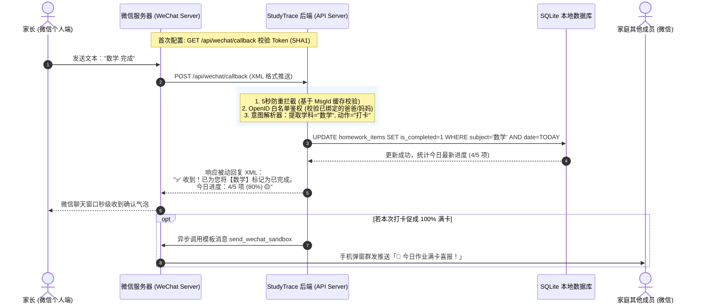

# 微信测试号双向交互引擎方案：发消息录入作业、打卡与学情快查 (WeChat Interactive Engine)

> **版本**：v1.0 (2026-09-08)  
> **状态**：方案已通过 `/grill-me` 深度访谈确认，待排期落地  
> **适用环境**：腾讯微信公众平台接口测试账号 (Sandbox) + FastAPI 后端 + SQLite

---

## 1. 业务背景与用户价值

在现有的 StudyTrace（智学迹）体系中，微信公众号测试号已成功打通**“下行消息推送（Push）”**，能够实现 20:10 / 21:10 催办、21:50 晚报、周日学情战报与艾宾浩斯错题复习提醒。

然而，家长在微信中收到提醒或督促孩子完成某科作业后，通常需要“点击链接 ➔ 手机浏览器加载系统 ➔ 找到对应条目 ➔ 点击打勾”，在移动场景下稍显繁琐。

本方案旨在打通**“上行消息接收与智能处理（Interactive Inbound Webhook）”**，实现：
> **“家长无需离开微信，直接在聊天窗口发一句话（如‘数学 做完了’或‘新增作业 语文 背诵古诗’），系统即可秒级自动更新数据库，并即时回复反馈卡片。”**

---

## 2. 核心设计决策 (Grill-Me 访谈共识)

| 决策维度 | 选定方案 | 设计考量与业务逻辑 |
| :--- | :--- | :--- |
| **消息解析模式** | **轻量规则口令 + 智能意图容错双模识别** | 同时支持口语化表达（如“数学 完成”、“打卡 数学”、“数学做完了”）与显式录入（“新增作业 英语 默写单词”），5秒内精准响应，不引入外部庞大 AI 模型依赖 |
| **安全鉴权机制** | **已绑定家庭成员 OpenID 自动白名单鉴权** | 仅响应在家长设置中已登记的 OpenID（如爸爸、妈妈），陌生微信发消息时返回“未授权家庭成员提示”，杜绝作业数据被无关人员污染 |
| **响应与同步策略** | **即时被动应答 + 关键满卡全家广播** | 操作人在微信内 5 秒收到即时反馈（如“✅ 已打卡数学，今日完成 4/5”）；若本次打卡促成当日全部完成，自动触发向全家多成员广播“🎉 今日满卡喜报” |
| **功能覆盖范围** | **全功能闭环指令集** | 覆盖：`打卡/完成`、`新增作业`、`今日作业`（清单查询）、`进度`（完成率与连续打卡）、`帮助` |

---

## 3. 系统架构与数据流转

### 3.1 架构时序图



---

## 4. 指令语法规范与意图映射字典

### 4.1 指令规则表

| 意图类型 | 用户常见输入示例 | 正则与语义提取逻辑 | 执行动作与返回示例 |
| :--- | :--- | :--- | :--- |
| **作业打卡 / 完成** | · `数学 完成`<br/>· `打卡 物理`<br/>· `数学 做完了`<br/>· `英语 搞定`<br/>· `已完成 语文` | 匹配学科关键词（语文/数学/英语/物理/化学/生物/历史/地理/道法）+ 动词（完成/打卡/搞定/做完/写完/已完） | 将今日该学科作业置为已完成。<br>回复：`✅ 收到！已将【数学】标记为完成。今日进度：4/5 项 🟡` |
| **新增作业** | · `新增作业 英语 默写第三单元单词`<br/>· `添加作业 语文 抄写生字词`<br/>· `留作业 数学 练习册第42页` | 匹配前缀（新增作业/添加作业/留作业/作业）+ 学科 + 具体内容描述 | 为今日自动新建一条待办作业项。<br>回复：`📝 已成功添加今日作业：【英语】默写第三单元单词！` |
| **查询今日作业** | · `今日作业`<br/>· `作业清单`<br/>· `还有什么作业`<br/>· `作业` | 匹配（今日作业/作业/清单/查作业） | 查询今日各科条目与完成状态。<br>回复：<br>`📅 王昱轩今日作业清单：`<br>`✅ 【语文】背诵第5课`<br>`⏳ 【数学】几何大题第3题`<br>`⏳ 【英语】单元默写`<br>`当前进度：1/3 (33%) 🟡` |
| **查询打卡进度** | · `进度`<br/>· `连续打卡`<br/>· `streak` | 匹配（进度/打卡天数/连续打卡/学情） | 回复连续打卡天数与当前作业完成比率。 |
| **获取帮助** | · `帮助`<br/>· `?`<br/>· `功能` | 匹配（帮助/help/?/怎么用） | 回复清晰的快捷指令使用指南。 |

---

## 5. 微信官方接口规范与技术实现细节

### 5.1 微信测试号配置要求
1. **接口 URL**：`https://study.raddishlab.tech/api/wechat/callback`
2. **Token**：自定义安全字符串，例如 `studytrace2026`（写入 `.env` 中的 `WECHAT_CALLBACK_TOKEN`）。

### 5.2 握手与校验 (GET 请求)
微信服务器接入校验参数：
- `signature`：微信加密签名
- `timestamp`：时间戳
- `nonce`：随机数
- `echostr`：随机字符串

校验算法：
```python
tmp_list = sorted([token, timestamp, nonce])
tmp_str = "".join(tmp_list).encode("utf-8")
hashcode = hashlib.sha1(tmp_str).hexdigest()
if hashcode == signature:
    return Response(content=echostr, media_type="text/plain")
```

### 5.3 消息接收与被动回复 (POST 请求)
- 接收 XML 报文：包含 `ToUserName`、`FromUserName`、`CreateTime`、`MsgType`、`Content`、`MsgId`。
- **5 秒防重保障**：将最近处理过的 `MsgId` 放入轻量内存 TTL 缓存（过期时间 15 秒），若收到重复 `MsgId` 直接返回 `"success"`。
- **白名单校验**：比对 `FromUserName` 是否在系统的 `WECHAT_OPEN_IDS` 清单中。
- 被动回复文本 XML：
```xml
<xml>
  <ToUserName><![CDATA[{FromUserName}]]></ToUserName>
  <FromUserName><![CDATA[{ToUserName}]]></FromUserName>
  <CreateTime>{int(time.time())}</CreateTime>
  <MsgType><![CDATA[text]]></MsgType>
  <Content><![CDATA[{reply_text}]]></Content>
</xml>
```

---

## 6. 实施路线图与任务清单

- [ ] **阶段 1：回调路由与鉴权接口**
  - 在 `backend/app/routers/` 下新增 `wechat.py` 路由。
  - 实现 `GET /api/wechat/callback` 签名验证。
  - 实现 `POST /api/wechat/callback` XML 接收与 `MsgId` 幂等防重。
- [ ] **阶段 2：意图解析与业务动作分发器**
  - 实现学科正则提取器（匹配初中 7 科与自定义学科）。
  - 实现“打卡完成”、“新增作业”、“清单查询”核心动作处理器。
- [ ] **阶段 3：满卡联动全家推送**
  - 当通过微信完成最后一项作业时，异步唤起 `send_wechat_sandbox` 触发满卡喜报广播。
- [ ] **阶段 4：自动化测试与真机演练**
  - 编写针对各种口语化输入的测试用例，并在真机微信聊天框完成全链路实测。
