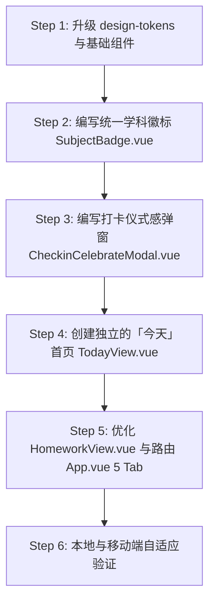

# 智学记移动端视觉与体验全面升级方案 (Phase 4: Warm & Living Polish)

> **核心目标**：深度对齐最新 UI 设计图，将「智学记」从偏理性的工具管理后台，升级为**温和、有激励感、生活化**的初中生成长学习助手。

---

## 一、 核心设计定位与四大增量洞察

对比原先的纯样式微调计划与用户提供的最新界面设计图，本轮升级明确以下定位与增量：

| 设计维度 | 现有版本 | 最新设计图呈现 | 本轮升级策略 |
|---|---|---|---|
| **首页定位** | 直接进入作业打卡周历列表（偏管理后台） | 独立「今天」概览页：温和问候 + 环形进度 + 今日任务清单 + 错题复习入口 + 学习时长分布 | **新建独立的「今天」首页 (`TodayView.vue`)**，将现有作业排期移至「作业」Tab |
| **底部导航** | 4 Tab（作业打卡、错题本、学情成绩、家长管理） | 5 Tab（首页、作业、错题、数据、我的） | **升级为 5 Tab 结构**，清晰解耦「今日概览」与「全量作业」 |
| **学科识别** | 统一为单行文字小胶囊 (`st-subject-tag`) | **高辨识度圆角方形（Squircle）彩色图形徽标**（数学蓝、语文绿、英语紫、物理橙、化学青等） | **建立统一的学科图形徽标组件 (`SubjectBadge.vue`)**，全站通用 |
| **进度感知** | 细线线性进度条 | **环形大卡片 (Donut Ring Chart)** + 2 列网格统计卡片（连续天数、今日时长） | **引入 SVG 环形进度组件**，形成首页第一眼视觉焦点 |
| **打卡反馈** | 仅列表项置灰划线 | **打卡成功仪式感弹窗 (Celebration Modal)**，展示连续天数徽章与成就文案 | **新增打卡成就弹窗**，带来强烈正向心理反馈 |
| **快捷操作** | 底部单一蓝色浮动按钮 | 首页底部双胶囊快捷入口：`[📷 录入作业]` 与 `[📝 录入错题]` | **新增悬浮双快捷胶囊**，一键直达录入 |

---

## 二、 架构调整与路由设计

### 1. 底部 5-Tab 架构对齐 (`App.vue` & `router/index.js`)

```text
┌───────────┬───────────┬───────────┬───────────┬───────────┐
│   首页    │   作业    │   错题    │   数据    │   我的    │
│  Today    │ Homework  │ Mistakes  │  Scores   │ Settings  │
│ wap-home  │ todo-list │  records  │ chart-tr  │  contact  │
└───────────┴───────────┴───────────┴───────────┴───────────┘
```

- `/` → **`TodayView.vue` [NEW]**：孩子每天打开的第一屏，展示问候、环形进度、今日清单、错题入口、专注概览。
- `/homework` → **`HomeworkView.vue` [MODIFY]**：承载 7 日周历、今日/全部/历史分段切换、作业沉浸式管理与打卡。
- `/mistakes` → **`MistakeView.vue`**：保留现有艾宾浩斯复习、错题录入、OCR 与原卷题干图。
- `/scores` → **`ScoreView.vue`**：学情成绩、雷达图、考试趋势与薄弱知识点分析。
- `/settings` → **`SettingsView.vue`**：对外标签改为「我的」，内部保留 PIN 码保护的家长控制、学科配置、通知备份。

---

## 三、 详细功能模块规划

### 1. 独立「今天」首页 (`TodayView.vue`)
- **顶部温和问候区**：
  - 动态问候：根据时间段自动显示「早上好 / 下午好 / 晚上好，[学生姓名]同学 👋」
  - 副标题：当前日期 + 农历/星期（如：`今天是 9月20日 周六`）
  - 右上角：柔和学习插图或学生头像微缩徽章
- **核心数据看板 (2-Column Grid)**：
  - **左侧大卡片**：环形进度图（今日完成率 60%，3/5 项完成），高质感渐变色环。
  - **右侧双层小卡片**：
    - 上层：`🔥 连续学习 12天 >`（点击直达历史作业打卡日历）
    - 下层：`⏱ 今日专注时长 1小时42分 >`（点击呼出专注番茄钟）
- **今日任务极简清单**：
  - 标题栏：`今日任务` + `查看全部 >`（跳转 `/homework`）
  - 清单列表：展示今日作业，左侧配专属学科 Squircle 彩色图标，中间显示作业标题与布置时间，右侧一键圆形打卡。
- **今日错题复习入口卡片**：
  - 靶心靶标图标 + `今日错题复习`
  - 动态副标：`还有 X 道题需要复习`（实时读取 `mistakeApi.getReviewQueue()` 队列）
  - 渐变按钮：`开始复习 >`（一键跳转错题本复习模式）
- **学习时长分布统计卡片**：
  - 今日总学习时长，按学科柱状条展示（数学 48min / 语文 31min / 英语 23min）。
  - 数据由 `PomodoroTimer` 专注计时完成后本地聚合记录，实现免后端表重构的平滑落地。
- **双快捷浮动录入栏 (Floating Action Bar)**：
  - `[ 📷 录入作业 ]`：唤起作业录入弹窗
  - `[ 📝 录入错题 ]`：唤起错题录入抽屉/跳转

### 2. 全局通用学科彩色徽标 (`SubjectBadge.vue`)
将目前分散在各个页面里的纯文字 `st-subject-tag` 规范化为图形化 Squircle 徽标：
- **数学**：高饱和蓝 `#3b82f6` + 几何/微积分符号（如 `∑` 或几何图形）
- **语文**：清新森林绿 `#10b981` + 书卷/萌芽（`文` 或 `book-o`）
- **英语**：活力雅紫 `#8b5cf6` + 经典英文徽标 `Aa`
- **物理**：阳光橙 `#f97316` + 能量/灯泡/原子（`bulb-o`）
- **化学**：碧波青 `#06b6d4` + 实验烧杯（`filter-o`）
- **其他学科**（地理、生物、历史、道法等）：配备对应独立色盘与标识。

### 3. 打卡成功仪式感弹窗 (`CheckinCelebrateModal.vue`)
- 当学生在首页或作业页点击完成作业时（特别是今日任务全部完成或单科完成）：
  - 弹出温和的仪式感卡片，包含柔和弹跳的绿色成功勾选动画；
  - 醒目文案：`打卡成功！你已经完成了今天的作业任务`；
  - 连续打卡荣耀金胶囊：`🔥 连续学习 12 天`；
  - 底部配上可爱的鼓励插画与「继续查看作业」主按钮。

### 4. 作业管理页 (`HomeworkView.vue`) 细节优化
- 顶部保留周历（Week Calendar），将标题改为「作业」，右上角保留加号快捷录入；
- 分段选择器（Segment Tabs）：`今日作业` | `全部作业` | `历史记录`；
- 作业卡片全面适配新的学科 Squircle 徽标；
- 底部常驻 `+ 录入作业` 悬浮药丸按钮。

### 5. 设计令牌拓展 (`design-tokens.css`)
- 补充暖色渐变（`--st-gradient-warm`, `--st-gradient-hero`）；
- 补充学科专用背景色与文字色变量；
- 补充成就金光阴影（`--st-shadow-achievement`）。

---

## 四、 实施步骤安排



### 具体文件变更计划：

#### [NEW] [SubjectBadge.vue](file:///d:/工作/ww/personal_work/study_trace/frontend/src/components/SubjectBadge.vue)
- 统一渲染学科圆角彩色方块（含图标与配色体系）。

#### [NEW] [CheckinCelebrateModal.vue](file:///d:/工作/ww/personal_work/study_trace/frontend/src/components/CheckinCelebrateModal.vue)
- 移动端仪式感打卡成功弹窗，含动画与连续打卡高光。

#### [NEW] [TodayView.vue](file:///d:/工作/ww/personal_work/study_trace/frontend/src/views/TodayView.vue)
- 对应设计图的第 1 页：动态问候语、环形进度图、任务清单、错题复习入口、学习时长分布、双快捷录入。

#### [MODIFY] [App.vue](file:///d:/工作/ww/personal_work/study_trace/frontend/src/App.vue)
- 底部 TabBar 升级为 5 Tab：首页、作业、错题、数据、我的。

#### [MODIFY] [router/index.js](file:///d:/工作/ww/personal_work/study_trace/frontend/src/router/index.js)
- `/` 路由指向 `TodayView`，`/homework` 路由指向 `HomeworkView`。

#### [MODIFY] [HomeworkView.vue](file:///d:/工作/ww/personal_work/study_trace/frontend/src/views/HomeworkView.vue)
- 引入 `SubjectBadge` 与打卡弹窗，微调分段控制器与卡片视觉。

#### [MODIFY] [design-tokens.css](file:///d:/工作/ww/personal_work/study_trace/frontend/src/assets/design-tokens.css)
- 注入学科主题色令牌、暖色柔和渐变与动效类。

---

## 五、 验证方案

1. **移动端首屏质感**：验证首页（TodayView）动态问候、环形图绘制、任务打卡流程。
2. **5-Tab 切换流畅度**：测试 5 个 Tab 间无缝切换，路由高亮正常。
3. **打卡仪式感反馈**：点击打卡后弹出祝贺弹窗，确认天数与文案正确展示。
4. **错题本联动**：首页「今日错题复习」准确读取并展示待复习题数，点击一键直达复习模式。
5. **回归测试**：确保原有的 7 日周历、跨天顺延、打印纸卷、番茄钟、PIN 码锁功能完整可用。
